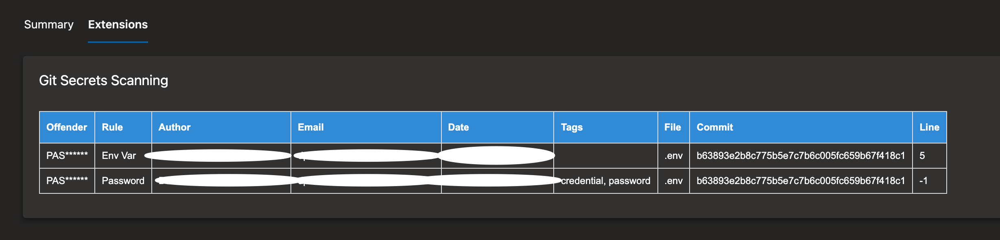

# Gitleaks Extension

This task downloads gitleaks and runs a gitleak scan on the specified repository.
This extension uses the powerful Gitleak to analyze the credentials in repositories.

## YAML Snippet

```
- task: gitleaks@1
  displayName: 'Git Scan'
  inputs:
    type: Default
```

## Display in Report

You can display gitleaks report in the pipeline in the extensions tab.



## How do I remove a secret from git's history?

[Github](https://docs.github.com/en/github/authenticating-to-github/removing-sensitive-data-from-a-repository) has a great article on this using the [BFG Repo Cleaner](https://rtyley.github.io/bfg-repo-cleaner/).